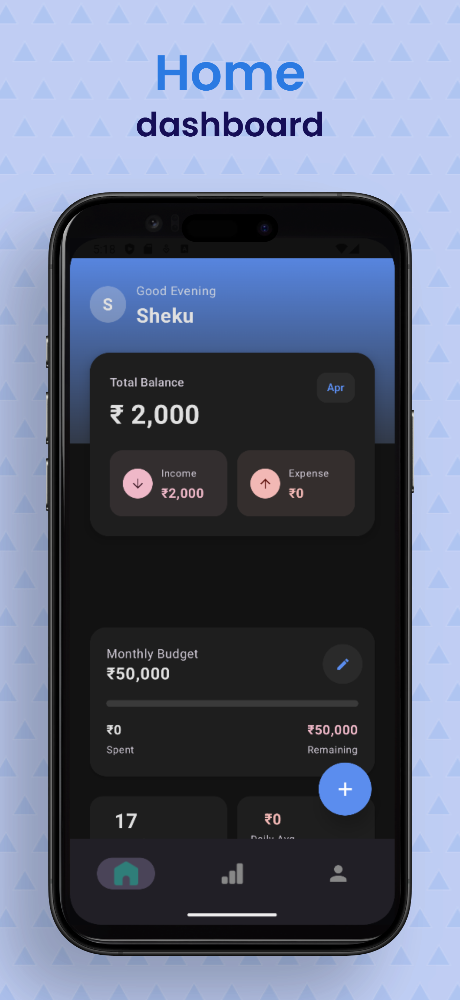
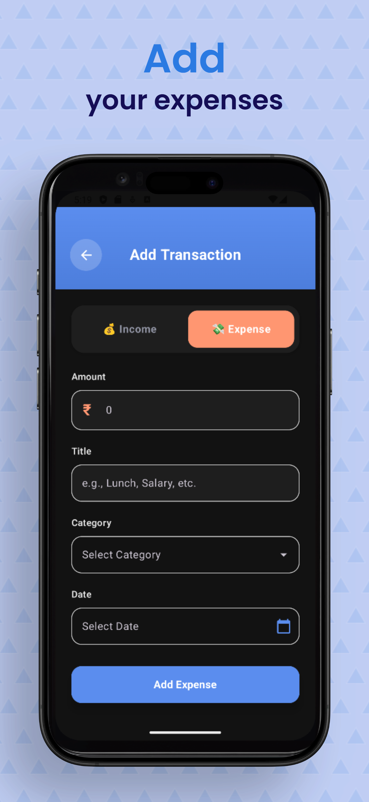
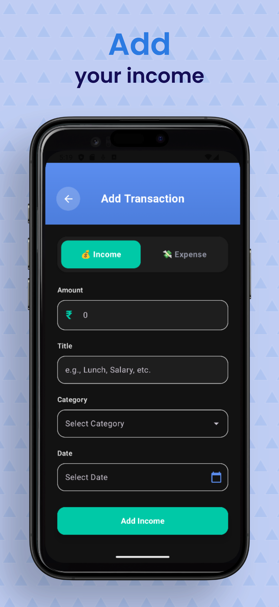
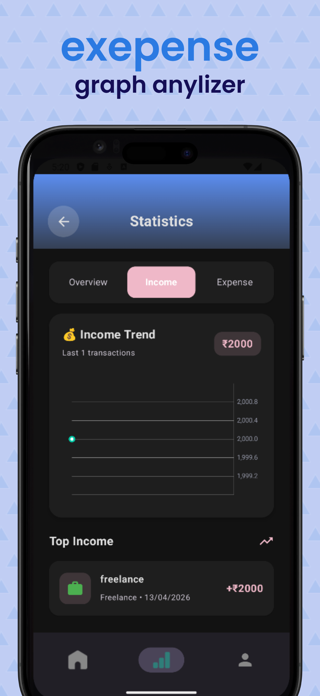
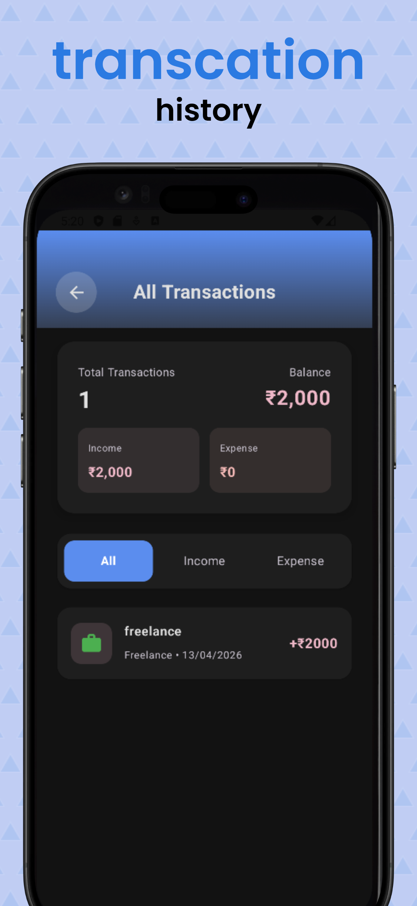

#  Expense Tracker App

> 📱 A modern Android application to track expenses, manage budgets, and monitor financial habits efficiently.

---

## 🚀 Features

* 📊 Track daily expenses and income
* 💼 Budget management system
* 📅 Filter transactions by date
* 🔔 Smart notifications & reminders
* ☁️ Firebase Authentication
* 📤 Export expense data
* 📈 Income vs Expense summary
* 👤 User profile management

---

## 🏗️ Tech Stack

* **Language:** Kotlin
* **UI:** Jetpack Compose
* **Architecture:** MVVM
* **Database:** Room
* **Dependency Injection:** Hilt
* **Backend:** Firebase Auth
* **Notifications:** Android System

---

## 📸 Screenshots

> 📱 Clean and intuitive UI designed for smooth expense tracking

<p align="center">
  
  
  
</p>

<p align="center">
  
  
  
</p>

<p align="center">
  
  
  
</p>

---

## 📁 Project Structure

```bash
com.example.expencetracker
│
├── data
│   ├── dao
│   ├── model
│   ├── ExpenseDatabase
│   └── AuthManager
│
├── di
├── repository
├── viewmodel
│
├── Screen
│   ├── AddExpense
│   ├── AllTransactions
│   ├── BudgetManagement
│   └── Profile
│
├── notification
├── utils
└── ui/theme
```

---

## ⚙️ Setup & Installation

### 1. Clone the repository

```bash
git clone https://github.com/HarshDev-hub/expense-tracker.git
```

### 2. Open in Android Studio

* Open project
* Let Gradle sync complete

### 3. Firebase Setup

* Replace `google-services.json.template` with your Firebase config
* Enable Email/Password Authentication

### 4. Run the App

* Connect emulator or device
* Click ▶️ Run

---

## 🧠 Architecture

This app follows **MVVM Architecture**:

```
UI → ViewModel → Repository → Database/Firebase
```

---

## 🔔 Notifications

* Uses NotificationHelper & Receiver
* Helps users stay on track with budgets

---

## 📤 Data Export

* Export expenses using ExportHelper
* Useful for backups and analysis

---

## ✨ Future Improvements

* 📊 Charts & analytics dashboard
* 🌙 Dark mode improvements
* ☁️ Cloud sync (Firestore)
* 📱 Multi-device support

---

## 🤝 Contributing

1. Fork the repo
2. Create a feature branch
3. Commit changes
4. Open Pull Request

---

## 👨‍💻 Author

**Your Name**
GitHub: https://github.com/HarshDev-hub

---

## ⭐ Show your support

If you like this project, give it a ⭐ on GitHub!
